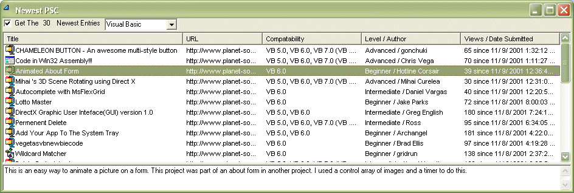



## get the x newest uploads to PSC

### Description

shows how to use the winsock control and the HTTP protocol to get the x newest uploads to PSC from any of the language worlds
 
### More Info
 

             |
---                |---
**Submitted On**   |2001-11-09 16:36:30
**By**             |[em ](https://github.com/Planet-Source-Code/PSCIndex/blob/master/ByAuthor/em.md)
**Level**          |Intermediate
**User Rating**    |4.8 (24 globes from 5 users)
**Compatibility**  |VB 6\.0
**Category**       |[Internet/ HTML](https://github.com/Planet-Source-Code/PSCIndex/blob/master/ByCategory/internet-html__1-34.md)
**World**          |[Visual Basic](https://github.com/Planet-Source-Code/PSCIndex/blob/master/ByWorld/visual-basic.md)
**Archive File**   |[get\_the\_x\_341541192001\.zip](https://github.com/Planet-Source-Code/em-get-the-x-newest-uploads-to-psc__1-28762/archive/master.zip)

